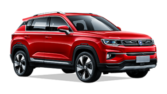

<!DOCTYPE html>
<html lang="fa" dir="rtl">
<head>
    <meta charset="UTF-8">
    <meta name="viewport" content="width=device-width, initial-scale=1.0">
    <title>جدول خودروها</title>
    <link rel="stylesheet" href="style.css">
</head>
<body>

    

    <table>
        <thead>
            <tr>
                <th>تصویر ماشین</th>
                <th>نام ماشین</th>
                <th>قیمت کل</th>
                <th>نقد</th>
                <th>وام</th>
                <th>قسط ۳۶ ماهه</th>
                <th>قسط ۶۰ ماهه</th>
            </tr>
        </thead>
        <tbody>
            <!-- سطر ۱ -->
                <tr>
                    <td></td>
                    <td>کلوت</td>
                    <td>1,880,000,000</td>
                    <td>670,000,000</td>
                    <td>1,210,000,000</td>
                    <td>46,800,000</td>
                    <td>34,100,000</td>
                </tr>
                <!-- سطر ۲ -->
                <tr>
                    <td></td>
                    <td>تیگو 7 پریمیوم</td>
                    <td>2,650,000,000</td>
                    <td>950,000,000</td>
                    <td>1,700,000,000</td>
                    <td>65,800,000</td>
                    <td>48,600,000</td>
                </tr>
                <!-- ... (۵۰ سطر دیگر به همین شکل) ... -->
                 <!-- سطر ۳ -->
                 <tr>
                    <td></td>
                    <td>رسپکت</td>
                    <td>1,635,000,000</td>
                    <td>600,000,000</td>
                    <td>1,035,000,000</td>
                    <td>40,000,000</td>
                    <td>29,100,000</td>
                </tr>
                 <!-- سطر ۴ -->
                 <tr>
                    <td></td>
                    <td>kmc t8</td>
                    <td>1,900,000,000</td>
                    <td>670,000,000</td>
                    <td>1,230,000,000</td>
                    <td>47,600,000</td>
                    <td>34,600,000</td>
                </tr>
                 <!-- سطر ۵ -->
                 <tr>
                    <td></td>
                    <td>kmc t9</td>
                    <td>2,830,000,000</td>
                    <td>1,000,000,000</td>
                    <td>1,830,000,000</td>
                    <td>70,800,000</td>
                    <td>51,500,000</td>
                </tr>
                 <!-- سطر ۶ -->
                 <tr>
                    <td></td>
                    <td>فونیکس تک دیفرانسیل</td>
                    <td>2,700,000,000</td>
                    <td>950,000,000</td>
                    <td>1,750,000,000</td>
                    <td>67,700,000</td>
                    <td>49,300,000</td>
                </tr>
                 <!-- سطر ۷ -->
                 <tr>
                    <td></td>
                    <td>فونیکس دو دیفرانسیل</td>
                    <td>2,900,000,000</td>
                    <td>1,020,000,000</td>
                    <td>1,880,000,000</td>
                    <td>72,700,000</td>
                    <td>53,000,000</td>
                </tr>
                 <!-- سطر ۸ -->
                 <tr>
                    <td></td>
                    <td>تیگو 8 پرومکس-پلاگین هیبرید</td>
                    <td>3,300,000,000</td>
                    <td>1,170,000,000</td>
                    <td>2,130,000,000</td>
                    <td>82,500,000</td>
                    <td>60,000,000</td>
                </tr>
                 <!-- سطر ۹ -->
                 <tr>
                    <td></td>
                    <td>ریرا اتومات</td>
                    <td>1,630,000,000</td>
                    <td>580,000,000</td>
                    <td>1,050,000,000</td>
                    <td>40,500,000</td>
                    <td>29,500,000</td>
                </tr>
                 <!-- سطر ۱۰ -->
                 <tr>
                    <td></td>
                    <td>لاماری اتومات</td>
                    <td>2,350,000,000</td>
                    <td>850,000,000</td>
                    <td>1,500,000,000</td>
                    <td>58,000,000</td>
                    <td>42,200,000</td>
                </tr>
                 <!-- سطر ۱۱ -->
                 <tr>
                    <td></td>
                    <td>لاماری هیبرید</td>
                    <td>2,650,000,000</td>
                    <td>950,000,000</td>
                    <td>1,700,000,000</td>
                    <td>65,800,000</td>
                    <td>48,000,000</td>
                </tr>
                 <!-- سطر ۱۲ -->
                 <tr>
                    <td></td>
                    <td>X55</td>
                    <td>1,800,000,000</td>
                    <td>650,000,000</td>
                    <td>1,150,000,000</td>
                    <td>44,500,000</td>
                    <td>32,500,000</td>
                </tr>
                 <!-- سطر ۱۳ -->
                 <tr>
                    <td></td>
                    <td> دنده X22</td>
                    <td>1,110,000,000</td>
                    <td>400,000,000</td>
                    <td>710,000,000</td>
                    <td>27,500,000</td>
                    <td>20,000,000</td>
                </tr>
                 <!-- سطر ۱۴ -->
                 <tr>
                    <td></td>
                    <td>kmc A5</td>
                    <td>1,830,000,000</td>
                    <td>650,000,000</td>
                    <td>1,180,000,000</td>
                    <td>45,500,000</td>
                    <td>33,200,000</td>
                </tr>
                 <!-- سطر ۱۵ -->
                 <tr>
                    <td></td>
                    <td>هایما S5</td>
                    <td>1,800,000,000</td>
                    <td>650,000,000</td>
                    <td>1,150,000,000</td>
                    <td>44,500,000</td>
                    <td>32,500,000</td>
                </tr>
                 <!-- سطر ۱۶ -->
                 <tr>
                    <td></td>
                    <td>KMC j7</td>
                    <td>1,895,000,000</td>
                    <td>665,00,000</td>
                    <td>1,230,000,000</td>
                    <td>47,500,000</td>
                    <td>34,500,000</td>
                </tr>
                 <!-- سطر ۱۷ -->
                 <tr>
                    <td></td>
                    <td>هایما S8</td>
                    <td>2,315,000,000</td>
                    <td>850,000,000</td>
                    <td>1,465,000,000</td>
                    <td>56,700,000</td>
                    <td>41,300,000</td>
                </tr>
                 <!-- سطر ۱۸ -->
                 <tr>
                    <td></td>
                    <td>هایما X7</td>
                    <td>2,265,000,000</td>
                    <td>800,000,000</td>
                    <td>1,465,000,000</td>
                    <td>56,700,000</td>
                    <td>41,300,000</td>
                </tr>
                 <!-- سطر ۱۹ -->
                 <tr>
                    <td></td>
                    <td>هایما S7</td>
                    <td>1,940,000,000</td>
                    <td>700,000,000</td>
                    <td>1,240,000,000</td>
                    <td>48,000,000</td>
                    <td>35,000,000</td>
                </tr>
                 <!-- سطر ۲۰ -->
                 <tr>
                    <td></td>
                    <td>فیدیلیتی 5 نفره الیت</td>
                    <td>2,275,000,000</td>
                    <td>840,000,000</td>
                    <td>1,435,000,000</td>
                    <td>55,500,000</td>
                    <td>40,500,000</td>
                </tr>
                 <!-- سطر ۲۱ -->
                 <tr>
                    <td></td>
                    <td>فیدیلیتی 5 نفره پرستیژ</td>
                    <td>3,315,000,000</td>
                    <td>1,200,000,000</td>
                    <td>2,115,000,000</td>
                    <td>82,000,000</td>
                    <td>60,000,000</td>
                </tr>
                 <!-- سطر ۲۲ -->
                 <tr>
                    <td></td>
                    <td>فیدیلیتی 7 نفره پرستیژ</td>
                    <td>3,350,000,000</td>
                    <td>1,235,000,000</td>
                    <td>2,115,000,000</td>
                    <td>82,000,000</td>
                    <td>60,000,000</td>
                </tr>
                 <!-- سطر ۲۳ -->
                 <tr>
                    <td></td>
                    <td>دیگنیتی 5 نفره پرایم</td>
                    <td>1,970,000,000</td>
                    <td>700,000,000</td>
                    <td>1,270,000,000</td>
                    <td>49,000,000</td>
                    <td>35,500,000</td>
                </tr>
                 <!-- سطر ۲۴ -->
                 <tr>
                    <td></td>
                    <td>دیگنیتی 7 نفره پرایم</td>
                    <td>1,990,000,000</td>
                    <td>700,000,000</td>
                    <td>1,290,000,000</td>
                    <td>50,000,000</td>
                    <td>36,500,000</td>
                </tr>
                 <!-- سطر ۲۵ -->
                 <tr>
                    <td></td>
                    <td>تویوتا لوین 1200</td>
                    <td>2,600,000,000</td>
                    <td>950,000,000</td>
                    <td>1,650,000,000</td>
                    <td>63,000,000</td>
                    <td>46,500,000</td>
                </tr>
                 <!-- سطر ۲۶ -->
                 <tr>
                    <td></td>
                    <td>تویوتا لوین 1800</td>
                    <td>3,035,000,000</td>
                    <td>1,100,000,000</td>
                    <td>1,935,000,000</td>
                    <td>75,000,000</td>
                    <td>54,500,000</td>
                </tr>
                 <!-- سطر ۲۷ -->
                 <tr>
                    <td></td>
                    <td>پژو 207 پانا دنده ارتقا</td>
                    <td>900,000,000</td>
                    <td>370,000,000</td>
                    <td>525,000,000</td>
                    <td>20,000,000</td>
                    <td>14,800,000</td>
                </tr>
                 <!-- سطر ۲۸ -->
                 <tr>
                    <td></td>
                    <td>پژو 207 پانا اتومات ارتقا</td>
                    <td>1.050,000,000</td>
                    <td>440,000,000</td>
                    <td>610,000,000</td>
                    <td>23,600,000</td>
                    <td>17,200,000</td>
                </tr>
                 <!-- سطر ۲۹ -->
                 <tr>
                    <td></td>
                    <td>TU3 207پژو</td>
                    <td>770,000,000</td>
                    <td>320,000,000</td>
                    <td>440,000,000</td>
                    <td>17,000,000</td>
                    <td>12,400,000</td>
                </tr>
                 <!-- سطر ۳۰ -->
                 <tr>
                    <td></td>
                    <td>پژو 207 هیدرولیک</td>
                    <td>820,000,000</td>
                    <td>340,000,000</td>
                    <td>480,000,000</td>
                    <td>18,600,000</td>
                    <td>13,500,000</td>
                </tr>
                 <!-- سطر ۳۱ -->
                 <tr>
                    <td></td>
                    <td>gt آریزو</td>
                    <td>2,135,000,000</td>
                    <td>860,000,000</td>
                    <td>1,275,00,000</td>
                    <td>50,000,000</td>
                    <td>36,000,000</td>
                </tr>
                 <!-- سطر ۳۲ -->
                 <tr>
                    <td></td>
                    <td>آریزو 6 پرو</td>
                    <td>1,925,000,000</td>
                    <td>775,000,000</td>
                    <td>1,150,000,000</td>
                    <td>44,500,000</td>
                    <td>32,500,000</td>
                </tr>
                 <!-- سطر ۳۳ -->
                 <tr>
                    <td></td>
                    <td>سورن پلاس</td>
                    <td>750,000,000</td>
                    <td>315,000,000</td>
                    <td>435,000,000</td>
                    <td>16,800,000</td>
                    <td>12,200,000</td>
                </tr>
                 <!-- سطر ۳۴ -->
                 <tr>
                    <td></td>
                    <td>سورن پلاس دوگانه مخزن کوچک</td>
                    <td>850,000,000</td>
                    <td>350,000,000</td>
                    <td>500,000,000</td>
                    <td>19,000,000</td>
                    <td>13,800,000</td>
                </tr>
                 <!-- سطر ۳۵ -->
                 <tr>
                    <td></td>
                    <td>سورن پلاس دوگانه مخزن بزرگ</td>
                    <td>880,000,000</td>
                    <td>360,000,000</td>
                    <td>520,000,000</td>
                    <td>20,100,000</td>
                    <td>14,700,000</td>
                </tr>
                 <!-- سطر ۳۶ -->
                 <tr>
                    <td></td>
                    <td>دنا پلاس بورسی</td>
                    <td>910,000,000</td>
                    <td>365,000,000</td>
                    <td>545,000,000</td>
                    <td>21,100,000</td>
                    <td>15,350,000</td>
                </tr>
                 <!-- سطر ۳۷ -->
                 <tr>
                    <td></td>
                    <td>دنا پلاس 6 دنده ای رینگ فولاد</td>
                    <td>960,000,000</td>
                    <td>395,000,000</td>
                    <td>565,000,000</td>
                    <td>21,900,000</td>
                    <td>16,000,000</td>
                </tr>
                 <!-- سطر ۳۸ -->
                 <tr>
                    <td></td>
                    <td>دنا پپلاس 6 دنده ای رینگ اسپورت</td>
                    <td>980,000,000</td>
                    <td>395,000,000</td>
                    <td>585,000,000</td>
                    <td>22,500,000</td>
                    <td>16,500,000</td>
                </tr>
                 <!-- سطر ۳۹ -->
                 <tr>
                    <td></td>
                    <td>دنا پلاس اتومات اپشنال</td>
                    <td>1,180,000,000</td>
                    <td>475,000,000</td>
                    <td>705,000,000</td>
                    <td>27,300,000</td>
                    <td>19,900,000</td>
                </tr>
                 <!-- سطر ۴۰ -->
                 <tr>
                    <td></td>
                    <td>اتومات MVM X33 cross </td>
                    <td>1,365,000,000</td>
                    <td>485,000,000</td>
                    <td>880,000,000</td>
                    <td>34,000,000</td>
                    <td>25,000,000</td>
                </tr>
                 <!-- سطر ۴۱ -->
                 <tr>
                    <td></td>
                    <td>cs35 چانگان</td>
                    <td>2,600,000,000</td>
                    <td>1,050,000,000</td>
                    <td>1,550,000,000</td>
                    <td>60,000,000</td>
                    <td>44,000,000</td>
                </tr>
                 <!-- سطر ۴۲ -->
                 <tr>
                    <td></td>
                    <td>چانگان توربو 1500 پلاس</td>
                    <td>2,690,000,000</td>
                    <td>1,100,000,000</td>
                    <td>1,590,000,000</td>
                    <td>61,500,000</td>
                    <td>45,000,000</td>
                </tr>
                 <!-- سطر ۴۳ -->
                 <tr>
                    <td></td>
                    <td>توربو1500 DL5 زوتی/td>
                    <td>1,200,000,000</td>
                    <td>430,000,000</td>
                    <td>790,000,000</td>
                    <td>30,500,000</td>
                    <td>22,300,000</td>
                </tr>
                 <!-- سطر ۴۴ -->
                 <tr>
                    <td></td>
                    <td>GXساینا دوگانه سوز</td>
                    <td>550,000,000</td>
                    <td>220,000,000</td>
                    <td>330,000,000</td>
                    <td>12,700,000</td>
                    <td>9,300,000</td>
                </tr>
                 <!-- سطر ۴۵ -->
                 <tr>
                    <td></td>
                    <td>S-ESPساینا</td>
                    <td>510,000,000</td>
                    <td>200,000,000</td>
                    <td>310,000,000</td>
                    <td>12,000,000</td>
                    <td>8,700,000</td>
                </tr>
                 <!-- سطر ۴۶ -->
                 <tr>
                    <td></td>
                    <td>S سهند</td>
                    <td>580,000,000</td>
                    <td>230,000,000</td>
                    <td>350,000,000</td>
                    <td>13,500,000</td>
                    <td>9,900,000</td>
                </tr>
                 <!-- سطر ۴۷ -->
                 <tr>
                    <td></td>
                    <td>G شاهین دنده ای</td>
                    <td>850,000,000</td>
                    <td>340,000,000</td>
                    <td>510,000,000</td>
                    <td>19,800,000</td>
                    <td>14,400,000</td>
                </tr>
                 <!-- سطر ۴۸ -->
                 <tr>
                    <td></td>
                    <td>شاهین اتومات</td>
                    <td>950,000,000</td>
                    <td>380,000,000</td>
                    <td>570,000,000</td>
                    <td>22,000,000</td>
                    <td>16,000,000</td>
                </tr>
                 <!-- سطر ۴۹ -->
                 <tr>
                    <td></td>
                    <td>شاهین اتوماتیک پلاس</td>
                    <td>1,150,000,000</td>
                    <td>460,000,000</td>
                    <td>690,000,000</td>
                    <td>26,700,000</td>
                    <td>19,500,000</td>
                </tr>
                 <!-- سطر ۵۰ -->
                 <tr>
                    <td></td>
                    <td>S کوییک</td>
                    <td>515,000,000</td>
                    <td>200,000,000</td>
                    <td>315,000,000</td>
                    <td>12,200,000</td>
                    <td>8,900,000</td>
                </tr>
                 <!-- سطر ۵۱ -->
                <tr>
                    <td></td>
                    <td>دنده ای GXR-L کوییک</td>
                    <td>520,000,000</td>
                    <td>205,000,000</td>
                    <td>315,000,000</td>
                    <td>12,200,000</td>
                    <td>8,900,000</td>
                </tr>
                 <!-- سطر ۵۲ -->
                <tr>
                    <td></td>
                    <td>بدون گارانتی SE پراید وانت 151</td>
                    <td>385,000,000</td>
                    <td>155,000,000</td>
                    <td>230,000,000</td>
                    <td>8,900,000</td>
                    <td>6,500,000</td>
                </tr>
                <!-- سطر ۵3 -->
                <tr>
                    <td></td>
                    <td>فول با گارانتی SE پراید وانت 151</td>
                    <td>430,000,000</td>
                    <td>175,000,000</td>
                    <td>255,000,000</td>
                    <td>9,800,000</td>
                    <td>7,200,000</td>
                </tr>
                <!-- سطر ۵4 -->
                <tr>
                    <td></td>
                    <td>وانت نیسان زامیاد آپشنال دوگانه</td>
                    <td>810,000,000</td>
                    <td>340,000,000</td>
                    <td>470,000,000</td>
                    <td>18,000,000</td>
                    <td>13,200,000</td>
                </tr>
                <!-- سطر ۵5 -->
                <tr>
                    <td></td>
                    <td> وانت نیسان زامیاد آپشنال بنزینی</td>
                    <td>795,000,000</td>
                    <td>340,000,000</td>
                    <td>455,000,000</td>
                    <td>17,600,000</td>
                    <td>12,800,000</td>
                </tr>
                <!-- سطر ۵6 -->
                 <tr>
                    <td></td>
                    <td>با سانروفG اطلس</td>
                    <td>599,000,000</td>
                    <td>240,000,000</td>
                    <td>359,000,000</td>
                    <td>13,900,000</td>
                    <td>10,000,000</td>
                </tr>
               <!-- سطر ۵6 -->
                 <tr>
                    <td></td>
                    <td>بدون سانروفGL اطلس</td>
                    <td>590,000,000</td>
                    <td>240,000,000</td>
                    <td>350,000,000</td>
                    <td>13,500,000</td>
                    <td>9,800,000</td>
                </tr>
                 <!-- سطر 57 -->
                 <tr>
                    <td></td>
                    <td>آریسان</td>
                    <td>580,000,000</td>
                    <td>235,000,000</td>
                    <td>345,000,000</td>
                    <td>13,350,000</td>
                    <td>9,700,000</td>
                </tr>
                <!-- سطر 58 -->
                 <tr>
                    <td></td>
                    <td>رانا پلاس</td>
                    <td>755,000,000</td>
                    <td>300,000,000</td>
                    <td>455,000,000</td>
                    <td>17,600,000</td>
                    <td>12,800,000</td>
                </tr>
                <!-- سطر 59 -->
                 <tr>
                    <td></td>
                    <td>تارا دنده ای</td>
                    <td>900,000,000</td>
                    <td>360,000,000</td>
                    <td>540,000,000</td>
                    <td>21,000,000</td>
                    <td>15,200,000</td>
                </tr>
                <!-- سطر 60 -->
                 <tr>
                    <td></td>
                    <td>تارا اتومات</td>
                    <td>1,100,000,000</td>
                    <td>450,000,000</td>
                    <td>650,000,000</td>
                    <td>25,100,000</td>
                    <td>18,300,000</td>
                </tr>
            </body>
        </table>
    

</body>
</html>
